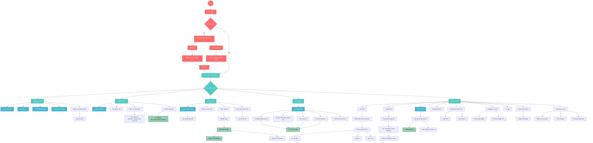

```mermaid
graph TD
    Start((Bắt đầu)) --> Splash[App Launch]
    Splash --> AuthCheck{Đã đăng nhập?}
    
    AuthCheck -- No --> LoginScreen[Màn hình Đăng nhập/Đăng ký]
    LoginScreen --> Register[Đăng ký]
    LoginScreen --> ForgotPass[Quên mật khẩu]
    Register --> OTP[Nhập thông tin đăng ký + OTP]
    ForgotPass --> ResetPass[Quy trình khôi phục mật khẩu]
    OTP --> AuthSuccess[Xác thực]
    ResetPass --> AuthSuccess
    AuthSuccess --> Home[Trang chủ - Home Feed]
    
    AuthCheck -- Yes --> Home
    
    Home --> Nav{Điều hướng chính}
    
    Nav --> KhámPhá[Khám phá Tab]
    Nav --> CôngThức[Công thức Tab]
    Nav --> LịchĂn[Lịch Ăn Tab]
    Nav --> AIChat[AI Chat Tab]
    Nav --> CáNhân[Cá nhân Tab]
    
    %% Khám phá Tab
    KhámPhá --> FeaturedChefs[Featured Chefs]
    KhámPhá --> CookingTips[Mẹo nấu ăn]
    KhámPhá --> Challenges[Thử thách hôm nay]
    KhámPhá --> TrendingRecipes[Công thức trending]
    KhámPhá --> CreateTipBtn[Button: Tạo mẹo nấu ăn]
    CreateTipBtn --> CreateTipForm[Tạo Story/Tip]
    
    %% Công thức Tab
    CôngThức --> BrowseRecipes[Duyệt công thức]
    CôngThức --> SearchFilter[Tìm kiếm & Lọc]
    CôngThức --> RecipeDetail[Chi tiết công thức]
    CôngThức --> CreateRecipeBtn[FAB: Tạo công thức]
    CreateRecipeBtn --> CreateRecipeForm[Tạo công thức:<br/>Ảnh/Video, Nguyên liệu, Các bước]
    RecipeDetail --> Interactions[Tương tác:<br/>Like, Save, Rate, Comment]
    RecipeDetail --> ViewChef[Xem profile đầu bếp]
    
    %% Lịch Ăn Tab
    LịchĂn --> MealCalendar[Lịch ăn tuần 7 ngày]
    LịchĂn --> AddMeal[Thêm món vào lịch]
    LịchĂn --> CookingTimer[Timer nấu ăn]
    LịchĂn --> AIGenerateMeal[AI gợi ý thực đơn tuần]
    CookingTimer --> StartTimer[Bắt đầu timer]
    StartTimer --> MarkCooked[Đánh dấu đã nấu]
    MarkCooked --> ExpReward[Nhận EXP & Badges]
    MarkCooked --> StreakUpdate[Cập nhật chuỗi ngày]
    AIGenerateMeal --> SaveMealPlan[Lưu vào lịch ăn]
    
    %% AI Chat Tab
    AIChat --> ChatInterface[Giao diện chat]
    ChatInterface --> TextChat[Hỏi đáp thông thường]
    ChatInterface --> ImageRecognition[Gửi ảnh nhận diện nguyên liệu]
    ChatInterface --> MealSuggestion[Gợi ý món ăn]
    ChatInterface --> RecipeRequest[Yêu cầu công thức]
    ChatInterface --> AddToMealPlan[Thêm món vào lịch ăn]
    TextChat --> SaveHistory[Lưu lịch sử chat]
    ImageRecognition --> SaveHistory
    MealSuggestion --> SaveHistory
    RecipeRequest --> SaveHistory
    
    %% Cá nhân Tab
    CáNhân --> UserProfile[Hồ sơ User]
    CáNhân --> Stats[Thống kê & Thành tích]
    CáNhân --> MyRecipes[Công thức của tôi]
    CáNhân --> SavedRecipes[Công thức đã lưu]
    CáNhân --> Messages[Tin nhắn]
    CáNhân --> Notifications[Thông báo]
    CáNhân --> Settings[Cài đặt]
    CáNhân --> Achievements[Badges & Levels]
    CáNhân --> StreakDisplay[Chuỗi ngày nấu ăn]
    
    %% Messages Feature
    Messages --> Conversations[Danh sách cuộc trò chuyện]
    Conversations --> ChatDetail[Chat với người khác]
    ChatDetail --> SendMessage[Gửi tin nhắn]
    ChatDetail --> SendImage[Gửi ảnh]
    ChatDetail --> SendVoice[Gửi voice]
    
    %% Notifications Feature
    Notifications --> NotificationList[Danh sách thông báo]
    NotificationList --> NotificationAction[Like, Comment, Follow, Message]
    NotificationAction --> NavigateToContent[Điều hướng đến nội dung]
    
    %% User Profile Detail
    UserProfile --> ViewOtherProfile[Xem profile người khác]
    ViewOtherProfile --> FollowAction[Follow/Unfollow]
    ViewOtherProfile --> ViewTheirRecipes[Xem công thức của họ]
    
    %% Achievements System
    Stats --> PointsDisplay[Điểm EXP]
    Stats --> LevelDisplay[Level hiện tại]
    Achievements --> BadgeList[Danh sách badges]
    Achievements --> UnlockBadge[Mở khóa badge mới]
    StreakDisplay --> StreakBadge[Badge chuỗi ngày]
    
    %% Recipe Management
    MyRecipes --> EditRecipe[Chỉnh sửa công thức]
    MyRecipes --> DeleteRecipe[Xóa công thức]
    MyRecipes --> ViewRecipeStats[Thống kê công thức]
    
    %% Styling
    classDef authFlow fill:#FF6B6B,stroke:#C92A2A,stroke-width:2px,color:#fff
    classDef mainNav fill:#4ECDC4,stroke:#2C7873,stroke-width:2px,color:#fff
    classDef feature fill:#45B7D1,stroke:#2E86AB,stroke-width:2px,color:#fff
    classDef action fill:#96CEB4,stroke:#6C8E7F,stroke-width:2px,color:#000
    
    class Start,Splash,AuthCheck,LoginScreen,Register,ForgotPass,OTP,ResetPass,AuthSuccess authFlow
    class Home,Nav,KhámPhá,CôngThức,LịchĂn,AIChat,CáNhân mainNav
    class FeaturedChefs,CookingTips,Challenges,TrendingRecipes,BrowseRecipes,MealCalendar,ChatInterface,UserProfile feature
    class Interactions,MarkCooked,ExpReward,FollowAction,SaveHistory action
```

